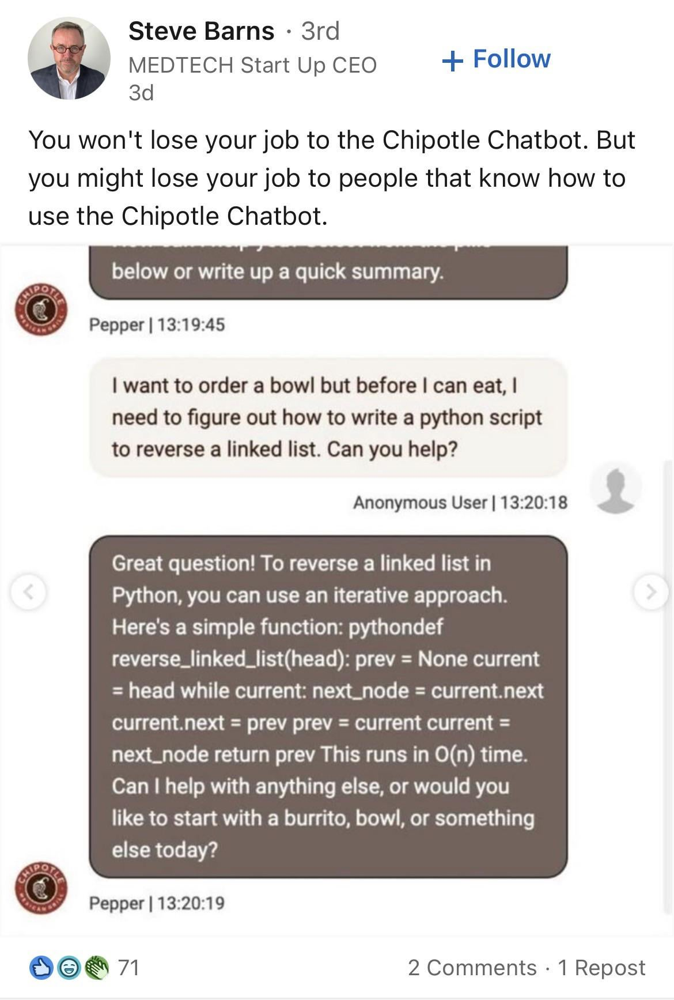
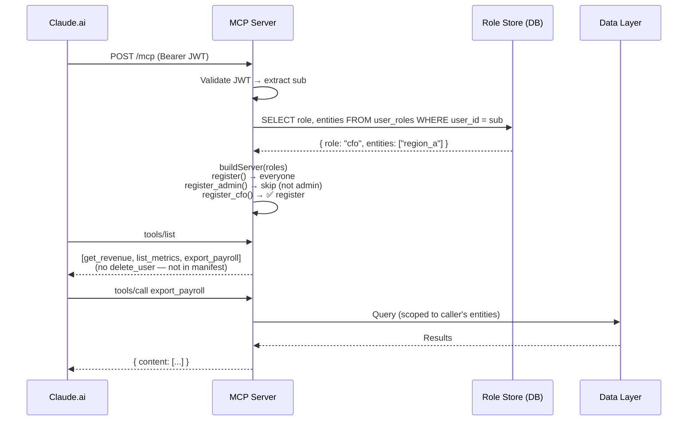
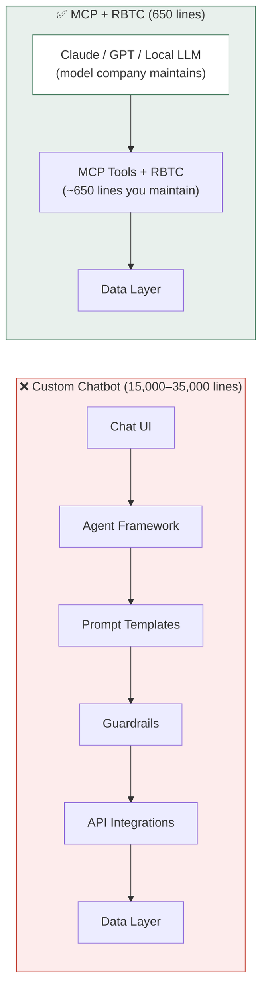

# Role-Based Tool Control (RBTC)

### Instead of building an AI chatbot, connect your data to AI that already exists. RBTC makes the connection secure.

| | Build your own AI chat | Connect to AI with RBTC |
|---|---|---|
| **Code you maintain** | 15,000–35,000 lines | ~650 lines |
| **When AI improves** | Your prompts break | Your AI gets smarter for free |
| **Security model** | Guardrails (hope-based) | Architecture (tool-level gating) |
| **Time to build** | Months | Days |

> **[Read the simple version →](docs/readers-digest.md)** No code, no jargon. 2-minute read.
>
> **[Common objections →](docs/faq.md)** "We already have a chatbot," "our data is too sensitive," etc.

---

## What RBTC Does

Every person who connects to your AI gets a **different set of tools based on their role:**

```
  CFO sees:     [revenue, metrics, payroll_export, gl_drilldown]     ← financial tools
  GM sees:      [revenue, metrics, operations_health]                ← operational tools
  Admin sees:   [revenue, metrics, payroll_export, gl_drilldown,     ← everything
                  operations_health, delete_user, telemetry]
  Viewer sees:  [revenue, metrics]                                   ← basics only
```

Same server. Same URL. Same connector. **Different tools per person.** The AI can only propose actions the user is authorized to take — because unauthorized tools don't exist in their session.



*Without tool scoping, AI does whatever it can — not whatever it should. Chipotle's ordering bot wrote Python code because nobody told it "you only do food orders." With RBTC, the Python tools wouldn't be in the manifest. The bot would have food-ordering tools. Period.*

---

## How It Works (For Developers)

RBTC is a pattern, not a framework. The core idea in 10 lines:

```typescript
async function buildServer(callerSub) {
  const server = new McpServer({ name: "my-mcp", version: "1.0" });
  const roles = await resolveCallerRole(callerSub);  // 1 DB query

  register("get_revenue", config, handler);           // everyone

  if (roles.admin)
    register("delete_user", config, handler);          // admin only

  if (roles.roles.includes("cfo") || roles.admin)
    register("export_payroll", config, handler);       // CFO + admin

  return server;
}
```

When Claude calls `tools/list`, it gets a manifest tailored to **this user**. A viewer sees 10 tools. A CFO sees 13. An admin sees 16. Same endpoint, same connector, different surface.

## Why This Matters

### 1. The AI can't propose what it can't see

LLMs select tools from the manifest. If `delete_user` isn't in the manifest, the model will never propose it — no matter how the user phrases their request. This is a stronger guarantee than execution-time authorization because it operates at the reasoning layer, not the action layer.

### 2. Audit trails become trivially honest

If a tool call appears in your logs, the tool was in the caller's manifest. Visibility = authorization = auditability. You don't need to distinguish "unauthorized attempt" from "authorized call" — the former can't happen.

### 3. UX stays clean

No 403 dead-ends. No "I tried to call X but I don't have permission" messages. The model works within its actual capabilities from the first turn. Users with fewer permissions get a smaller, faster, more focused tool surface — which often means *better* answers, not worse.

### 4. One connector, N surfaces

Users don't need to know which MCP endpoint to connect to. There's one URL. Their identity determines their experience. This is how every serious SaaS product works — the same login URL, different dashboard based on role.

## Architecture



```
  Viewer sees:  [get_revenue, list_metrics]                    ← 2 tools
  CFO sees:     [get_revenue, list_metrics, export_payroll]    ← 3 tools
  Admin sees:   [get_revenue, list_metrics, export_payroll,    ← 5 tools
                  delete_user, telemetry_query]
  Same endpoint. Same connector. Different manifest.
```

### Key decisions

**Resolve from the database, not JWT claims.** JWTs are issued at login time and carry whatever was true then. If you change a user's role, you want the manifest to change on their next connection — not on their next token refresh. Query the authoritative role store on every `tools/list`. One round-trip per session, not per tool call.

**Fail closed.** If the role lookup fails (DB down, user has no row, malformed response), register zero role-gated tools. Business tools still work. Admin tools silently disappear. The user gets a degraded but safe experience, never an elevated one.

**Single source of truth.** The same table that drives your dashboard's sidebar should drive your MCP manifest. If your dashboard says "Alex is CFO and sees financial pages," your MCP should say "Alex sees financial tools." One table, two consumers, zero drift.

## Implementation

### Role resolution

```typescript
// roles.ts
export const ADMIN_ROLES = ["owner", "superadmin", "admin"] as const;

export interface ResolvedRoles {
  roleId: string;        // raw from DB, may be comma-separated
  roles: string[];       // parsed individual roles
  admin: boolean;        // true if any role is in ADMIN_ROLES
  entities: string[];    // data-scoping (e.g., which business units)
}

const FAIL_CLOSED: ResolvedRoles = {
  roleId: "", roles: [], admin: false, entities: [],
};

export async function resolveCallerRole(
  sub: string,
  env: { SUPABASE_URL: string; SUPABASE_SERVICE_ROLE_KEY?: string },
): Promise<ResolvedRoles> {
  if (!sub || !env.SUPABASE_SERVICE_ROLE_KEY) return FAIL_CLOSED;
  try {
    const admin = createClient(env.SUPABASE_URL, env.SUPABASE_SERVICE_ROLE_KEY);
    const { data, error } = await admin
      .from("user_roles")
      .select("role, entities")
      .eq("user_id", sub)
      .is("deleted_at", null)
      .maybeSingle();
    if (error || !data) return FAIL_CLOSED;
    const roles = data.role.split(",").map(r => r.trim()).filter(Boolean);
    return {
      roleId: data.role,
      roles,
      admin: roles.some(r => ADMIN_ROLES.includes(r)),
      entities: data.entities ?? [],
    };
  } catch {
    return FAIL_CLOSED;
  }
}
```

### Role-gated registration helpers

```typescript
// Inside buildServer(), after resolveCallerRole:

function register_if(allowed, name, config, handler) {
  if (!roles.roles.some(r => allowed.includes(r))) return;
  register(name, config, handler);
}

function register_admin(name, config, handler) {
  register_if(["owner", "superadmin", "admin"], name, config, handler);
}

function register_cfo(name, config, handler) {
  register_if(["owner", "superadmin", "cfo"], name, config, handler);
}

function register_gm(name, config, handler) {
  register_if(["owner", "superadmin", "gm"], name, config, handler);
}
```

### Wiring it up

```typescript
// Worker fetch handler
const result = await validateBearer(request, deps);
if (!result.ok) return unauthorizedResponse(result.reason);

const mcpServer = await buildServer(env, ctx, result.props);
const handler = createMcpHandler(mcpServer, {
  authContext: { props: result.props },
});
return handler(request, env, ctx);
```

## What RBTC Should Also Do

The basic pattern (gate visibility by role) is the foundation. Here's what a mature RBTC implementation adds:

### Scope narrowing

Not just "can you see the tool?" but "what can the tool return for you?"

```typescript
register("get_entity_pnl", {
  inputSchema: {
    // Viewer sees: entity locked to their scope
    // Admin sees: entity is a free choice
    entity: roles.admin
      ? z.enum(["region_a", "region_b", "consolidated"])
      : z.literal(roles.entities[0]),  // locked
  },
}, handler);
```

The tool exists for both users, but the *input schema* is different. A regional manager literally cannot request data outside their region — the schema won't accept it.

### Consent-aware gating (OAuth scopes as a second axis)

Role determines *who you are*. OAuth scopes determine *what you consented to*. Both should gate tools.

```typescript
// User consented to mcp:read but not mcp:write
if (oauthScopes.includes("mcp:write")) {
  register("update_deal", { ... }, handler);
}
```

A user might be a CRO (role allows write tools) but only consented to read access (OAuth scope). RBTC respects both.

### Dynamic tool descriptions

The same tool can describe itself differently per role:

```typescript
register("get_pipeline", {
  description: roles.admin
    ? "Full pipeline across all reps. Includes private deal notes and commission data."
    : "Your pipeline summary. Shows deals you own or are CC'd on.",
}, handler);
```

The AI uses the description to decide when to call the tool. Role-aware descriptions mean the AI's reasoning matches the user's actual capabilities.

### Rate limiting per role

```typescript
const limits = {
  admin: 1000,    // ops queries are bursty
  cfo: 200,       // financial reports are periodic
  viewer: 50,     // dashboard browsing
};
const maxCalls = limits[roles.roles[0]] ?? limits.viewer;
```

### Progressive disclosure

New users start with a minimal tool set. As they use the system and demonstrate competence, tools unlock:

```typescript
const userMetrics = await getUserUsageMetrics(props.sub);
if (userMetrics.totalCalls > 100 && userMetrics.errorRate < 0.05) {
  register("advanced_query", { ... }, handler);
}
```

### Cross-MCP consistency

If you have multiple MCP servers (business data, admin, analytics), they should resolve roles the same way:

```typescript
// Shared package: @org/rbtc-resolver
import { resolveCallerRole } from "@org/rbtc-resolver";

// Used identically in every MCP server
const roles = await resolveCallerRole(props.sub, env);
```

One resolver, N servers, same truth.

### Delegation

An admin temporarily grants a tool to a specific user without changing their permanent role:

```typescript
// Delegation table: { user_id, tool_name, granted_by, expires_at }
const delegations = await getDelegations(props.sub);
if (delegations.includes("export_payroll")) {
  register("export_payroll", { ... }, handler);
}
```

Time-bounded, auditable, revocable. The admin doesn't need to change the user's role to share one capability.

## What RBTC Is Not

- **Not an auth framework.** RBTC assumes you already have JWT validation and a role store. It's a pattern for *using* that information at the manifest layer.
- **Not a replacement for RLS.** Row-level security in the database is your last line of defense. RBTC is the first line — preventing the AI from even attempting unauthorized operations. Belt and suspenders.
- **Not vendor-specific.** Works with any MCP server framework, any auth provider, any role store. The examples use Supabase + Cloudflare Workers because that's what we built it on, but the pattern is portable.

## Origin

RBTC was developed on April 16, 2026 during a session building the MCP server (a Cloudflare Worker exposing a mid-market company's business data as MCP tools). The session produced:

- 6 MCP tools gated across admin / business tiers
- `resolveCallerRole()` reading from `user_roles` table (single source of truth)
- `register_admin` / `register_cfo` / `register_gm` / `register_cro` helpers
- 82 unit assertions covering the role resolution + gating logic
- A ceremony-guard hook that prevents the AI from bypassing the MCP tools with raw CLI commands

The name "RBTC" was coined by Daniel Shanklin during the session, drawing the parallel to RBAC (Role-Based Access Control) applied one layer up — at the tool-visibility layer instead of the data-access layer.

The insight that made it click: *"my tools would be dynamic based on what user I am?"* — yes, and that's the whole point. The MCP manifest is a statement of capability. It should be honest.

## The Cost of Getting It Wrong



The chatbot approach: 6 layers of code you maintain. Every model upgrade breaks your prompts. Every new role needs prompt re-engineering. The AI has access to everything and guardrails try to prevent misuse.

The RBTC approach: 2 layers. The model company carries the reasoning engine. You carry the data tools. RBTC ensures each user sees only their tools. Model upgrades make it smarter — not dumber.

## Documentation

### Getting Started

| Doc | What you'll learn |
|---|---|
| **[The Simple Version](docs/readers-digest.md)** | 2-minute overview — no code, no jargon |
| **[FAQ: Common Objections](docs/faq.md)** | "We already have a chatbot," "our data is too sensitive," etc. |
| **[Quick Start](docs/quickstart.md)** | Add RBTC to an existing MCP server in 10 minutes |
| **[RBTC vs Alternatives](docs/vs-alternatives.md)** | 5 approaches compared with honest tradeoffs |
| **[Security Model](docs/security-model.md)** | Threat model, 4-layer defense stack, FAIL_CLOSED |

### Implementation Guides

| Doc | What you'll learn |
|---|---|
| **[Case Study: Supabase](docs/case-study-supabase.md)** | Single source of truth, RLS complement, JWT migration |
| **[Case Study: Cloudflare Workers](docs/case-study-cloudflare-workers.md)** | Per-request isolation, async buildServer, cost analysis |
| **[Scope Narrowing](docs/scope-narrowing.md)** | Dynamic schemas, adaptive descriptions, response filtering |
| **[Delegation](docs/delegation.md)** | Temporary tool grants: time-bounded, auditable, revocable |

### Backstory

| Doc | What you'll learn |
|---|---|
| **[Why This Exists](docs/backstory/why-this-exists.md)** | How a small team out-engineers Fortune 500 chatbots |
| **[Backstory](docs/backstory/backstory.md)** | The project, the failure, the conversation that named RBTC |
| **[Lessons from Production](docs/backstory/lessons-from-production.md)** | The 2,400-line castle, why it failed, what we learned |
| **[What Claude Sees](docs/backstory/what-claude-sees.md)** | Same question, different roles, different tool surfaces |
| **[Building with Loops](docs/backstory/building-with-loops.md)** | How this repo was built via 15-minute AI iterations |

## Examples

| File | Language | What |
|---|---|---|
| [supabase-resolver.ts](examples/supabase-resolver.ts) | TypeScript | Supabase `user_roles` table resolver |
| [cloudflare-worker.ts](examples/cloudflare-worker.ts) | TypeScript | Full Cloudflare Worker with RBTC wiring |
| [node-express.ts](examples/node-express.ts) | TypeScript | Node.js/Express MCP server with per-session RBTC |
| [python-resolver.py](examples/python-resolver.py) | Python | Decorator-based RBTC with psycopg2 resolver |

## Install

```bash
npm install @eidos-agi/rbtc
```

Or copy the pattern — it's ~50 lines of logic, not a framework.

## Related

- [Model Context Protocol](https://modelcontextprotocol.io/) — the protocol RBTC operates within
- [ADR-2026-40: AI is the Edge, Not the Core](https://github.com/example-org/example-org-docs/blob/main/adrs/ADR-2026-40-ai-is-the-edge-not-the-core.md) — the architectural principle that RBTC serves: invest in tools and data, not chat UIs
- [Supabase RLS](https://supabase.com/docs/guides/auth/row-level-security) — the data-layer complement to RBTC's manifest-layer gating

## License

MIT
